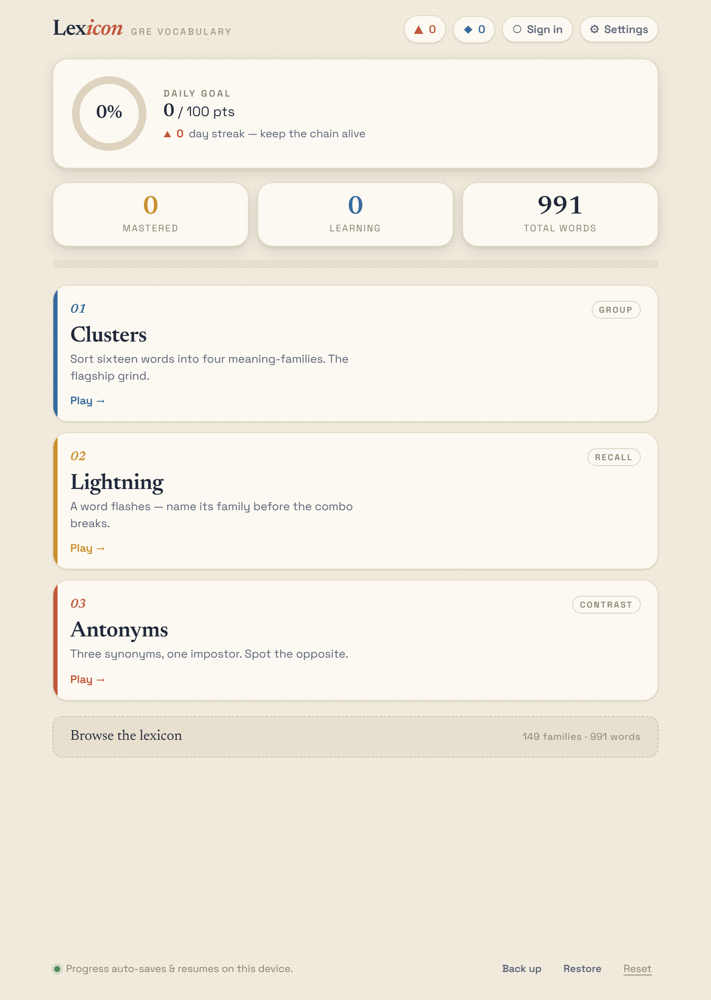
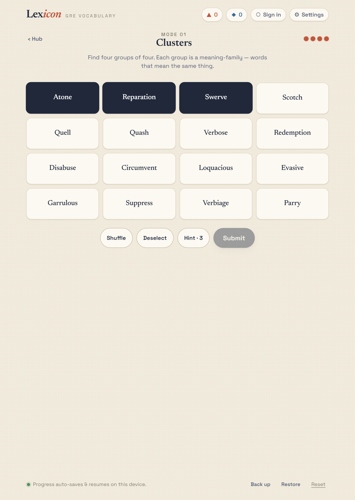
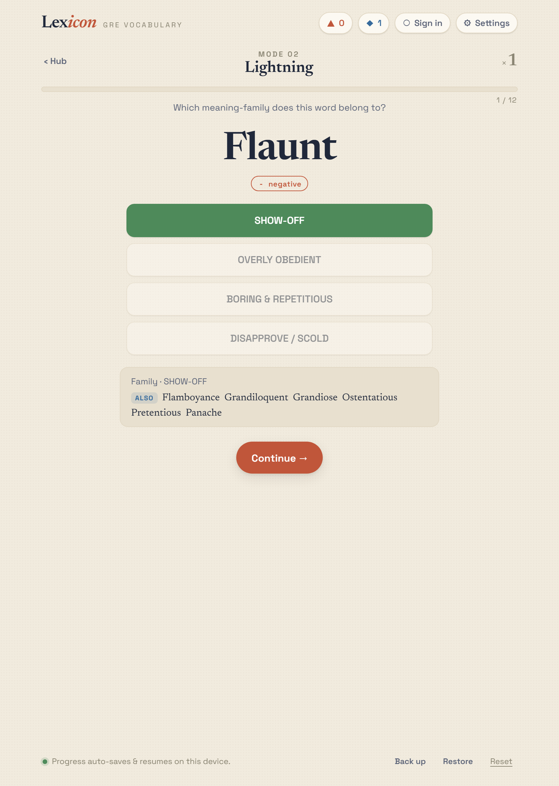
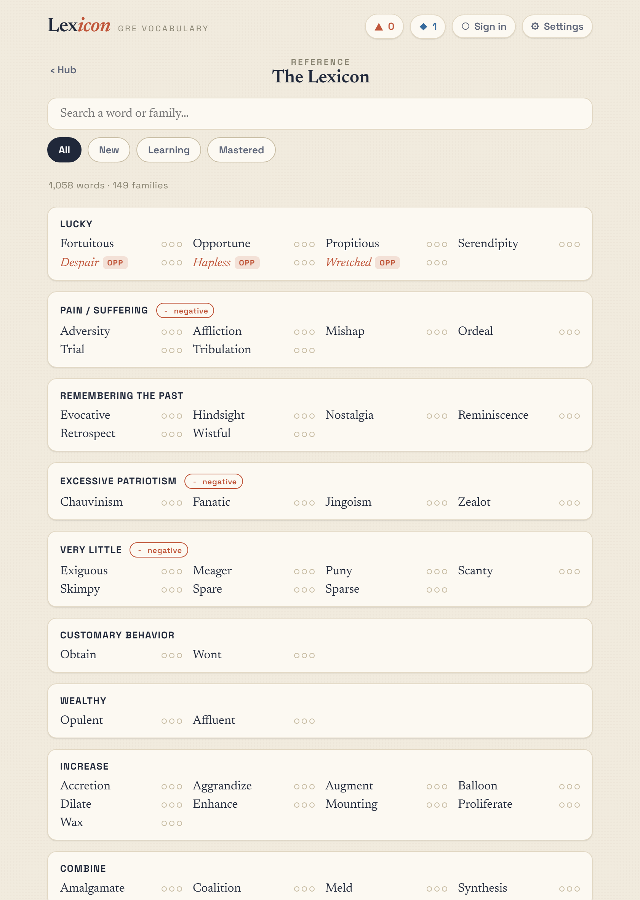
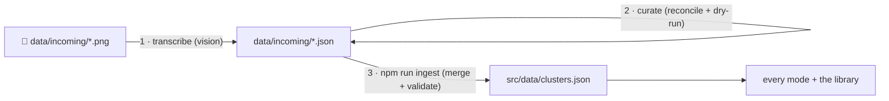

<div align="center">

# 📖 Lexicon

### Learn GRE vocabulary by the company words keep.

A daily-puzzle vocabulary game built around **meaning-families** — clusters of words
that mean the same thing. Sort them, race to recall them, spot the odd one out, and
watch your mastery grow. **991 words across 149 families**, fully playable offline.

[**▶️ Play the live app**](https://vocab-games-ashwin.vercel.app) &nbsp;·&nbsp;
[Architecture](docs/ARCHITECTURE.md) &nbsp;·&nbsp;
[Contributing](CONTRIBUTING.md) &nbsp;·&nbsp;
[Changelog](CHANGELOG.md)

[](https://github.com/ashwingoyal154/Vocabulary-Games/actions/workflows/ci.yml)
[](LICENSE)




</div>

---

## Why Lexicon

Most flashcard apps drill words one at a time, in isolation. But GRE vocabulary is
really about **distinctions between near-synonyms** — knowing that *attenuate*,
*enervate*, and *effete* all live in the "lose strength / weaken" family, and which
words are the opposite. Lexicon makes that family structure the core mechanic: every
mode teaches words *in relation to each other*, and every answer reveals the whole
family so the connections stick.

## Game modes

| | Mode | What you do |
|---|---|---|
| 🟦 | **Clusters** | Sort sixteen words into four hidden meaning-families (Connections-style). |
| ⚡ | **Lightning** | A word flashes — name its family before the combo breaks. Get it right once and it's mastered; only the words you miss come back. |
| ↔️ | **Antonyms** | Three synonyms and one impostor — spot the opposite. |
| 📚 | **The Lexicon** | A searchable, filterable library of every family and word, with per-word mastery tracking. |

<div align="center">

| Clusters | Lightning |
|:---:|:---:|
|  |  |
| **The Lexicon** | **Mastery-aware reveals** |
|  | Every reveal shows the *entire* family, so you learn the cluster — not just one word. |

</div>

## Highlights

- **🧠 Adaptive repetition.** A word answered correctly in Lightning is mastered and
  retires from the rotation; missed and unseen words are weighted to come back. Mastery
  is tracked per word (0–3) and surfaced as live counts.
- **🔌 Offline-first, zero required backend.** The vocabulary is bundled at build time —
  no API calls to play. Progress auto-saves to `localStorage`, with portable backup/restore
  codes to move between devices.
- **☁️ Optional accounts & cloud sync.** Add a free Supabase project to enable email +
  password accounts and cross-device sync. Local-first and **fail-closed** — a failed
  network read can never overwrite good cloud progress.
- **📈 First-party analytics + admin dashboard.** Cookie-less event tracking into an
  insert-only table, with an admin-gated `#admin` dashboard (KPIs, funnels, charts).
- **📝 In-app feedback.** A built-in sheet for bug reports, feature requests, and 1–5★
  ratings writes to a dedicated insert-only table and surfaces in the admin dashboard —
  with a `mailto:` fallback so nothing is ever lost.
- **📱 Mobile-first & accessible.** Audited for zero horizontal overflow and ≥44px tap
  targets across five phone widths.
- **🤝 Shareable recaps.** Wordle-style text summaries of any round via the native share sheet.

## The standout: a screenshot → game content pipeline

The vocabulary is **content, not code**, and it grows through a deterministic pipeline.
Drop in screenshots of word lists and Claude Code reads them *with its own vision*
(no paid OCR/vision API), reconciles them against the existing dataset, and merges them
in — with validation gating every step.



The merge is non-destructive and **nothing is written if the result fails validation**.
See [`lexicon/data/README.md`](lexicon/data/README.md) for the format.

## Tech stack

**React 19** · **Vite 8** · **TypeScript 6** · **Supabase** (optional: auth + Postgres
with row-level security) · **Vitest** + headless-Chrome E2E (over the DevTools Protocol,
no Puppeteer) · deployed on **Vercel**. No UI framework and no router library — the design
is a hand-built warm-paper system (Newsreader + Space Grotesk).

## Quick start

```sh
cd lexicon
npm install
npm run dev        # http://localhost:5173
```

That's it — the game is fully playable local-only. To enable accounts/sync/analytics,
copy `lexicon/.env.example` to `.env`, add your Supabase keys, and run the SQL in
`lexicon/supabase/`. Full setup is in [`lexicon/README.md`](lexicon/README.md).

## Quality & testing

CI runs lint → dataset validation → unit tests → production build on every push and PR.

```sh
npm run lint       # eslint
npm run validate   # dataset invariants + coverage stats (gates the build)
npm test           # Vitest unit suite (store, sync contract, dataset, share text)
npm run build      # validate -> tsc -b -> vite build

# behavior/UI changes — need `npm run dev` running:
npm run smoke      # every screen mounts, no console/runtime errors
npm run e2e        # full playthroughs: rounds, persistence, backup/restore, #admin
npm run mobile     # overflow + tap-target audit across 5 phone widths
```

## Architecture in one breath

A static SPA that's fully functional on its own, with an optional Supabase layer that
no-ops when its env vars are absent. State is a single `localStorage`-backed store;
the vocabulary is a bundled, validated dataset everything derives from; cloud sync is
local-first and fail-closed. The full picture — data model, sync contract, content
pipeline, testing, and design trade-offs — is in **[docs/ARCHITECTURE.md](docs/ARCHITECTURE.md)**.

## Repository layout

```
Vocabulary-Games/
├─ lexicon/              # 👈 the app (React + Vite + TS). Do work here.
│  ├─ src/data/          # bundled vocabulary dataset + parser (the single source of truth)
│  ├─ src/modes/         # full screens: Hub, Clusters, Quiz (Lightning/Antonyms), Library, Dashboard
│  ├─ src/components/    # shared UI (badges, progress ring, toasts, auth, sync, charts)
│  ├─ src/lib/           # store, hooks, sync, auth, analytics, share
│  ├─ supabase/          # SQL: schema + RLS, analytics, admin dashboard
│  ├─ scripts/           # dataset validate/ingest + headless E2E & mobile harnesses
│  └─ tests/             # Vitest unit suite
├─ docs/                 # architecture, screenshots, design-handoff origin
├─ project/  chats/      # original Claude Design prototypes + design transcripts
└─ .github/              # CI, Dependabot, issue/PR templates
```

## Roadmap

- Spaced-repetition scheduling (decay mastery over time, not just within a session)
- More vocabulary domains beyond GRE
- Per-family difficulty tuning from real play analytics
- Optional sound + haptics

## Contributing

PRs welcome — start with [CONTRIBUTING.md](CONTRIBUTING.md). Two project invariants are
non-negotiable: **no paid external services**, and **never lose a player's progress**.
Please also read the [Code of Conduct](CODE_OF_CONDUCT.md) and
[Security Policy](SECURITY.md).

## Origin

Lexicon began as a [Claude Design](https://claude.ai/design) prototype and was
implemented for real as this app — see [docs/DESIGN_HANDOFF.md](docs/DESIGN_HANDOFF.md).

## License

[MIT](LICENSE) © 2026 Ashwin Goyal
