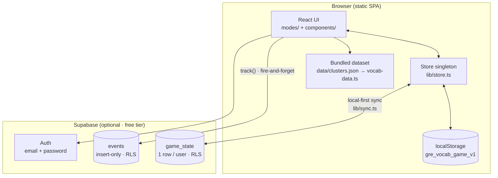
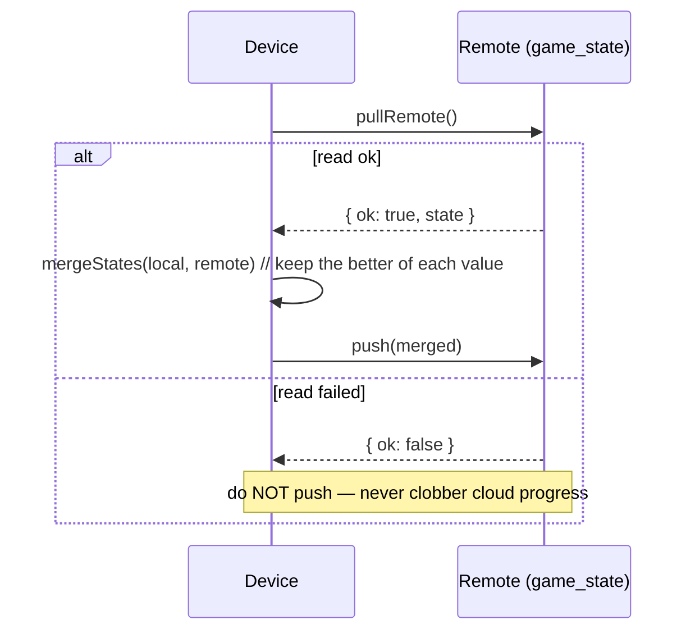
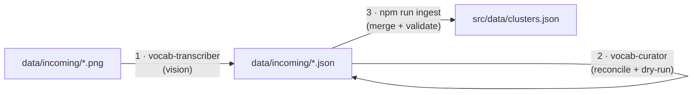

# Architecture

Lexicon is a **client-first single-page app**: a static React/Vite/TypeScript bundle
that is fully playable with no backend. An optional Supabase layer adds accounts,
cloud sync, and analytics — and degrades to a no-op when its env vars are absent.

If `VITE_SUPABASE_URL` / `VITE_SUPABASE_ANON_KEY` are unset, `supabase.ts` exports
`null`, every consumer checks for that, and the whole right-hand side disappears.

## Data is content, not code

The vocabulary is a **bundled dataset**, not a database query. `src/data/clusters.json`
is canonical; `src/data/vocab-data.ts` parses it once at module load into the exports
everything else derives from:

| Export | What it is |
|---|---|
| `CLUSTERS` | meaning-families with parsed members + antonyms |
| `WORD_INDEX` | word → which families/roles it appears in |
| `ALL_MEMBER_WORDS` | every learnable word |
| `BIG_CLUSTERS` | families with ≥4 members (eligible for a Clusters tile group) |
| `ANTONYM_CLUSTERS` | families with antonyms (eligible for Antonyms mode) |

Word **role** is encoded as a one-character prefix on each string; family
**connotation** lives on `conn`:

| Prefix | Role | | `conn` | Meaning |
|---|---|---|---|---|
| `X ` | antonym | | `"+"` | positive |
| `* ` | near-synonym | | `"-"` | negative |
| `# ` | unrelated | | `null` | neutral |
| (none) | synonym member | | | |

Because every mode derives from these exports, the dataset can grow to thousands of
words **without touching game code**. `npm run validate` enforces the invariants
(roles, duplicates, minimum sizes) and **gates the build**.

## State & persistence

`lib/store.ts` is a module-level singleton object plus a `Set` of subscribers,
persisted to `localStorage` under the key **`gre_vocab_game_v1`**. Components read it
through `useStore()`.

- **Forward-compatible loads.** `merge()` deep-merges a saved blob over `DEFAULT`, so
  an older/partial save never crashes on a missing field. *Invariant: extend `merge()`
  and the `GameState` interface together.*
- **Everything rides one blob.** Session reviews (shareable recaps) live inside
  `GameState`, so they get localStorage persistence and cloud sync for free.

### Mastery & repetition model

Each word carries a `mastery` level **0–3** (`3` = mastered). Two write paths:

- `recordWord(word, correct)` — gradual ±1, clamped. Used by **Clusters** and **Antonyms**.
- `masterWord(word)` — jumps to 3. Used by **Lightning**: one correct answer masters it.

**Lightning repeats only what you miss** — `weightedWord()` draws only from words below
mastery 3 (falling back to the full set if everything is mastered). Clusters weights by
mastery but never excludes, so a learned word can still reappear there. This keeps drilling
focused on weak spots while reinforcing whole families on every reveal.

## Optional cloud layer

### Sync — local-first, fail-closed

`lib/sync.ts` (driven by the headless `components/ProgressSync.tsx`) mirrors the entire
`GameState` to a single per-user `game_state` row. The **load-bearing contract**: a
*failed read must never trigger a push*, or a transient error would overwrite good cloud
progress with an empty device.

`mergeStates()` combines guest + account progress by keeping the better of each
cumulative value (e.g. `mastery` is max-merged — so mastering a word can never be
undone by a merge). An `OWNER_KEY` in localStorage stops one account's progress from
leaking into another on a shared browser.

### Auth & analytics

- **Auth** (`lib/auth.tsx`) — email + password via Supabase.
- **Analytics** (`lib/analytics.ts`) — `track(name, props)` fire-and-forgets a row into
  an **insert-only** `events` table. It never throws and logs only at `console.debug`
  (the smoke test fails on `console.error`). The `#admin` dashboard reads aggregates
  through functions gated by an admin-email check.
- **Feedback** (`lib/feedback.ts` + `components/Feedback.tsx`) — bug reports, suggestions,
  and 1–5★ ratings write to a separate **insert-only** `feedback` table (same RLS shape as
  `events`), surfaced in the `#admin` dashboard. Falls back to a `mailto:` link when
  Supabase is absent or a write fails, so feedback is never lost.

## Content pipeline (screenshot → game)

The distinctive workflow for growing the dataset — no paid vision API; Claude Code
reads the screenshots itself.

The ingest is deterministic and non-destructive: same-name families merge, new names
append, words de-dup + uppercase, role conflicts are flagged — and **if the merged
result fails validation, nothing is written**.

## Testing strategy

| Layer | Command | What it guards |
|---|---|---|
| Unit | `npm test` | store save/load/merge, **sync fail-closed contract**, dataset invariants, share text |
| Smoke (E2E) | `npm run smoke` | every screen mounts; zero console/runtime errors |
| Full E2E | `npm run e2e` | real playthroughs: rounds, reload persistence, old-save migration, backup/restore, `#admin` |
| Mobile | `npm run mobile` | horizontal overflow + sub-44px tap targets across 5 phone widths |

The headless harnesses talk to Chrome over the DevTools Protocol using Node's built-in
`fetch`/`WebSocket` — **no Puppeteer/Playwright dependency**.

## Deployment

Static build (`npm run build` → `dist/`) deployed on **Vercel**. The Supabase anon key
is public by design; data is protected by row-level security (see [`../SECURITY.md`](../SECURITY.md)).
SQL setup scripts live in `lexicon/supabase/` and are run once each in the SQL editor.

## Key design decisions

| Decision | Why | Trade-off |
|---|---|---|
| Bundle the dataset; no DB for word lookups | Instant, offline-capable, free | Dataset changes require a redeploy |
| Optional Supabase, no-op without env | App works 100% local-first | Two code paths to keep in sync |
| Single-blob state + `localStorage` | Simple, durable, syncs as one unit | Must keep `merge()`/`mergeStates` aligned with `GameState` |
| Local-first, fail-closed sync | Never lose a signed-in player's progress | Slightly more conservative conflict handling |
| CDP harnesses over Puppeteer | Zero heavy test deps, fast CI | More manual driving code |
| No router library | One real route (`#admin`); `App.tsx` switches on a string | Not suited to deep linking later |
